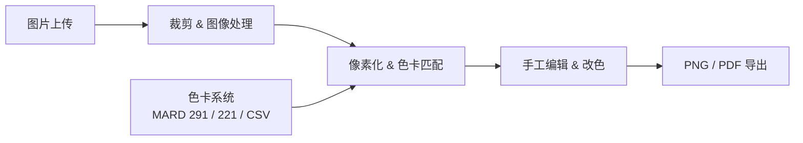

# Bead Pattern Studio / 拼豆图纸转换器

[](https://www.typescriptlang.org/)
[](https://nextjs.org/)
[](https://tailwindcss.com/)

一站式拼豆创作平台 — 从任意图片生成精确的拼豆图纸，支持色卡匹配、手工改色、用量统计和专业导出。

> **Live Demo** :point_right: [bead-pattern-studio.moirahou1.chatgpt.site](https://bead-pattern-studio.moirahou1.chatgpt.site)

## Features

| 功能 | 说明 |
|------|------|
| **图片处理** | 上传、裁剪、亮度/对比度/饱和度调节、简易去背景 |
| **智能匹配** | RGB 转 Lab 色彩空间，最近色匹配算法 |
| **色卡系统** | 默认 MARD 291 全色 / MARD 221 常用，支持店铺色卡 CSV 导入 |
| **精确控制** | 成品尺寸设定、豆数预估、色数上限、单格点击改色 |
| **撤销/重做** | 完整的操作历史栈 |
| **专业导出** | PNG/PDF 图纸，含网格、坐标、色号和图例 |
| **社区原型** | 作品发现、收藏、复刻，发布草稿管理（移动端） |

## 项目目标

面向拼豆玩家、店主、图纸设计师和手作创作者，提供从 **图片 → 图纸 → 作品 → 分享 → 材料连接** 的完整链路。

```
短期  准确好用的图纸生成器
中期  项目保存、作品集、小程序传播
长期  真实店铺色卡、库存、价格、订单估算、图纸商城
```

## 技术架构



## 本地开发

```bash
npm install
npm run dev       # 启动开发服务器
npm run build     # 构建生产版本
```

核心页面：`app/BeadPatternApp.tsx` | 样式：`app/globals.css`

## 文档

- [产品蓝图](docs/product-blueprint.md) — 产品愿景与阶段规划
- [产品计划](docs/product-plan.md) — 迭代计划与优先级
- [技术架构](docs/technical-architecture.md) — 系统设计与技术选型
- [色卡数据规范](docs/palette-format.md) — 色卡格式与导入规则
- [色号来源验证](docs/color-source-audit.md) — 色号数据交叉校验
- [算法路线图](docs/algorithm-roadmap.md) — 匹配算法演进计划
- [社区产品设计](docs/community-product.md) — 社区功能设计文档

## Roadmap

- [ ] A4 分页导出、坐标索引、采购清单、封面模板
- [ ] 项目保存 & 作品集数据模型
- [ ] 真实品牌/店铺色卡管理
- [ ] 边缘保护、肤色保护、手工锁色等进阶算法
- [ ] 公开作品页 & 个人作品集

## License

This project is currently published as a portfolio prototype.
